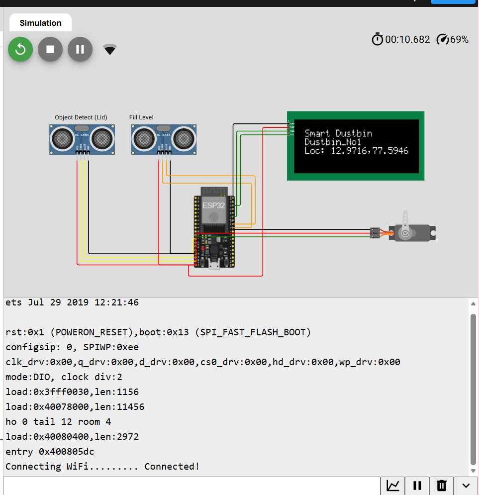
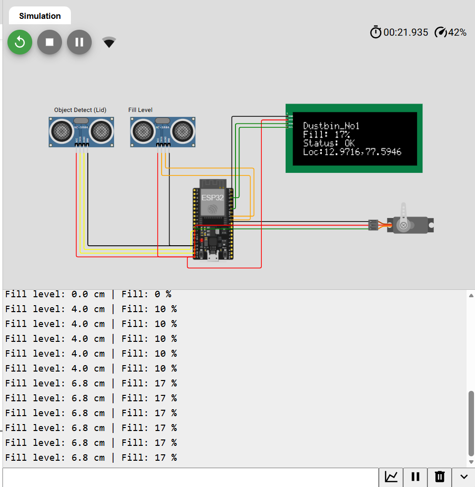
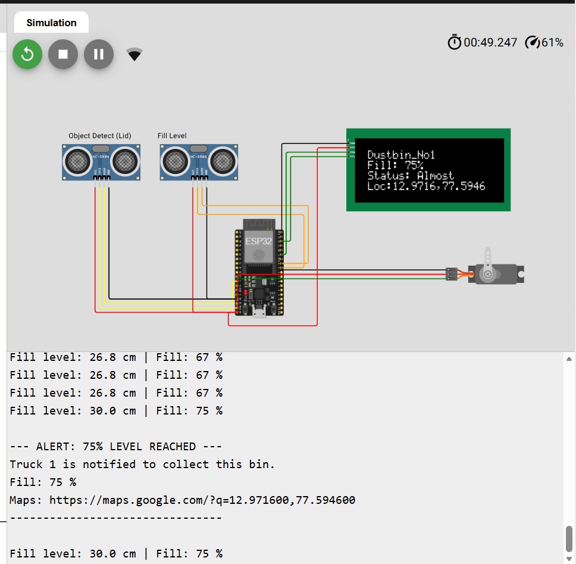
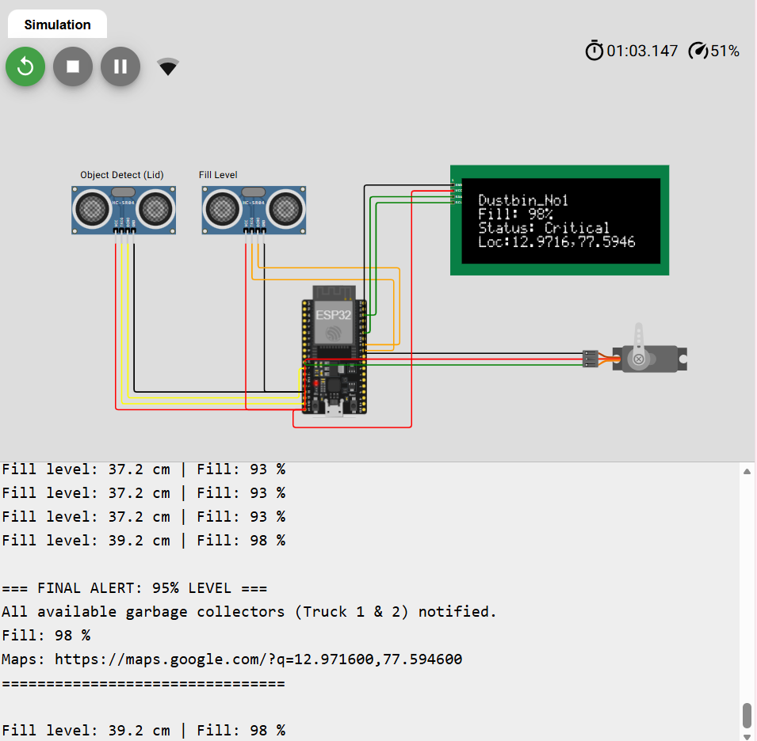
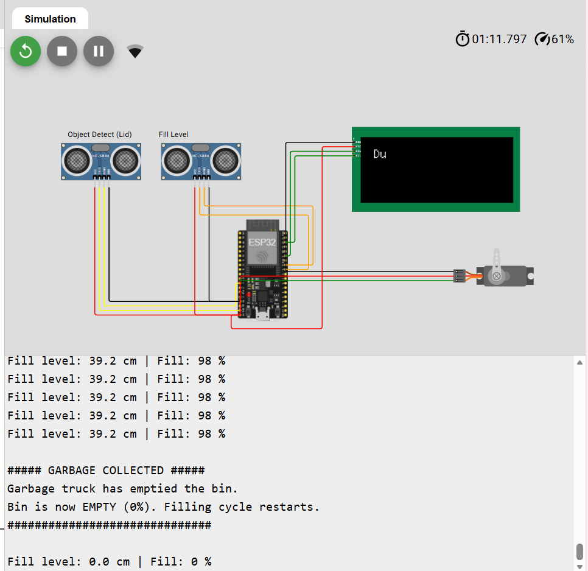

# ♻️ IoT-Based Smart Waste Management System

<p align="center">


</p>

<p align="center">
An ESP32-based Smart Waste Management System that monitors garbage fill levels, detects approaching users, automatically opens the dustbin lid, displays real-time information on an LCD, and sends notifications through Blynk IoT.
</p>

---

# 🌐 Live Wokwi Simulation

🔗 **Project Link**

https://wokwi.com/projects/449653586435836929

---

# 📖 Project Overview

The **IoT-Based Smart Waste Management System** is designed to improve urban waste collection using IoT technology. Traditional waste collection follows fixed schedules, often resulting in overflowing bins or unnecessary collection trips.

This project uses an **ESP32 microcontroller**, ultrasonic sensors, a servo motor, and a 20×4 LCD display to continuously monitor the garbage level. The system sends updates to the **Blynk IoT Cloud**, generates notifications when the dustbin reaches critical levels, and simulates the garbage collection process.

The project demonstrates how IoT can help create cleaner cities by enabling smart, real-time waste monitoring.

---

# ✨ Features

- ♻️ Smart garbage fill-level monitoring
- 📏 Dual HC-SR04 ultrasonic sensors
- 🚶 Object detection
- 🛠 Automatic lid opening using servo motor
- 📺 20×4 I2C LCD display
- ☁️ Blynk IoT cloud integration
- 📍 GPS location support (simulation)
- 📲 GSM/SMS alert logic (simulation)
- 🚛 Truck notification system
- ⚠️ Overflow detection
- 🔄 Automatic reset after garbage collection
- 🌍 Fully simulated using Wokwi

---

# 🛠 Hardware Components

| Component | Quantity |
|-----------|----------|
| ESP32 DevKit V1 | 1 |
| HC-SR04 Ultrasonic Sensor | 2 |
| Servo Motor | 1 |
| 20×4 I2C LCD | 1 |
| NEO-6M GPS Module | 1 *(logic implemented)* |
| SIM900A GSM Module | 1 *(logic implemented)* |
| Jumper Wires | As Required |

---

# 🔌 ESP32 Pin Mapping

| Component | GPIO Pin |
|-----------|----------|
| Object Sensor Trigger | GPIO 13 |
| Object Sensor Echo | GPIO 14 |
| Fill Level Trigger | GPIO 18 |
| Fill Level Echo | GPIO 19 |
| Servo Motor | GPIO 27 |
| LCD SDA | GPIO 21 |
| LCD SCL | GPIO 22 |

---

# 💻 Software Requirements

- Arduino IDE
- ESP32 Board Package
- Wokwi Simulator
- Blynk IoT
- Wire Library
- LiquidCrystal_I2C
- WiFi
- WiFiClient

---

# 📁 Repository Structure

```text
iot-based-smart-waste-management-system/
│
├── README.md
├── LICENSE
├── .gitignore
│
├── src/
│   ├── smart_waste_management.ino
│   ├── diagram.json
│   └── libraries.txt
│
├── simulation/
│   └── wokwi_link.md
│
├── docs/
│   ├── Mini_Project_Synopsis.pdf
│   ├── Final_Project_Report.pdf
│   ├── Phase1_Presentation.pdf
│   └── Phase2_Presentation.pdf
│
└── images/
    ├── hardware_setup.jpg
    ├── startup.png
    ├── fill17.png
    ├── fill51.png
    ├── alert75.png
    ├── alert95.png
    └── collection.png
```

---

# ⚙️ System Workflow

```text
User Approaches Dustbin
          │
          ▼
Object Detection Sensor
          │
          ▼
Servo Motor Opens Lid
          │
          ▼
Waste Deposited
          │
          ▼
Fill-Level Sensor Measures Garbage
          │
          ▼
ESP32 Processes Data
          │
          ▼
LCD Displays Fill Percentage
          │
          ▼
Blynk Dashboard Updated
          │
          ▼
75% Alert → Truck 1
95% Alert → Emergency Notification
100% → Overflow Warning
          │
          ▼
Garbage Collection
          │
          ▼
Bin Reset to 0%
```

---

# 🚨 Alert Levels

| Fill Level | Status | Action |
|------------|--------|--------|
| 0–49% | 🟢 Normal | Monitoring |
| 50–74% | 🟡 Moderate | Continue Monitoring |
| 75–94% | 🟠 Almost Full | Truck 1 Notification |
| 95–99% | 🔴 Critical | Notify All Trucks |
| 100% | ⚫ Overflow | Immediate Collection |

---

# 📸 Project Gallery

## Wokwi Circuit


---

## System Startup



---

## Fill Level Monitoring

|17% Fill|51% Fill|
|---------|---------|
|||

---

## Alert Notifications

|75% Alert|95% Alert|
|----------|----------|
|||

---

## Garbage Collection



---

# 📄 Documentation

The complete project documentation is available in the **docs** folder.

- 📘 Mini Project Synopsis
- 📄 Final Project Report
- 📊 Phase 1 Presentation
- 📊 Phase 2 Presentation

---

# ▶️ How to Run

### Wokwi Simulation

1. Open the Wokwi project.
2. Click **Start Simulation**.
3. Observe the LCD display.
4. Change ultrasonic sensor values.
5. Monitor the Serial Monitor.
6. Observe Blynk dashboard updates.

### Arduino IDE

1. Install Arduino IDE.
2. Install the ESP32 Board Package.
3. Install the required libraries.
4. Open `smart_waste_management.ino`.
5. Replace the Blynk credentials with your own.
6. Upload the sketch to the ESP32.

---

# ☁️ Libraries Used

- LiquidCrystal_I2C
- Wire
- WiFi
- WiFiClient
- BlynkSimpleEsp32

---

# 🚀 Future Scope

- 📱 Android Mobile Application
- ☁️ Cloud Database Integration
- 🤖 AI-Based Waste Prediction
- 🚛 Smart Route Optimization
- 📍 Real-Time GPS Tracking
- 📲 Real GSM SMS Alerts
- 🌞 Solar-Powered Smart Bin
- 🏙 Smart City Dashboard

---

# 👥 Team Members

- **Isra Zainab**
- **Madeeha Mohammed Mubeen**
- **Saniya Naz**
- **Shamma Shirin M.A**

---

# 👨‍🏫 Project Guide

**<!-- Akshata Dange -->**

---

# 🏫 Institution

**<Yenepoya Institute Of Technology>**

**Department of Computer Science and Engineering (IoT, Cyber Security with Blockchain Technology)**

**Academic Year:** 2025–2026

---

# 📜 License

This project is licensed under the **MIT License**.

See the **LICENSE** file for complete details.

---

# 🙏 Acknowledgements

- Arduino
- Espressif Systems
- Blynk IoT
- Wokwi Simulator
- Open Source Community

---

<p align="center">

⭐ **If you like this project, consider giving it a Star on GitHub!** ⭐

Made with ❤️ by **Isra Zainab and Team**

</p>
